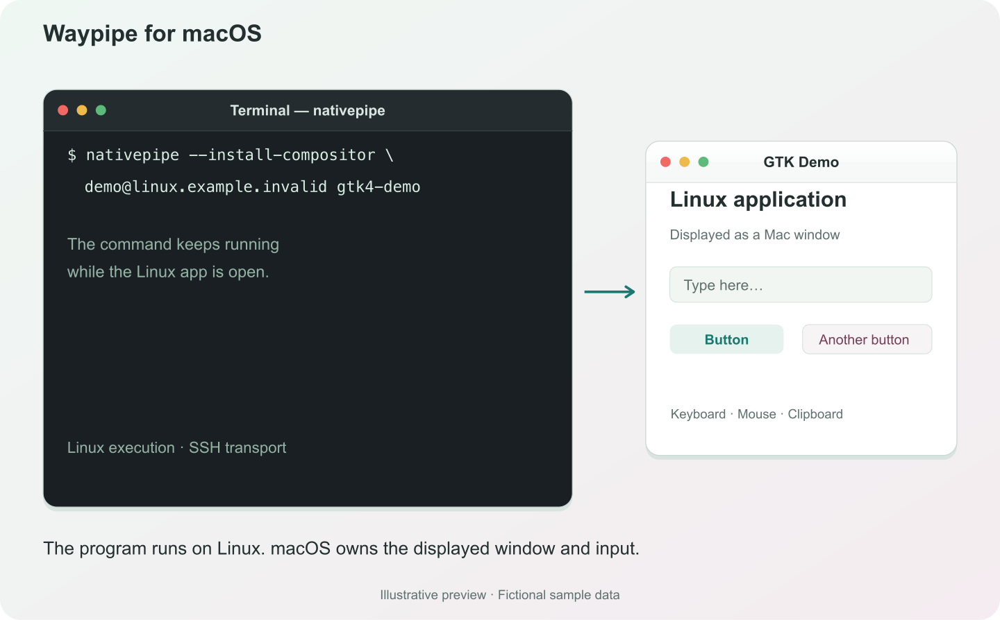

# NativePipe


**Waypipe for macOS.** Run Linux graphical applications over SSH and use their
windows alongside your Mac apps.

NativePipe brings the [waypipe](https://gitlab.freedesktop.org/mstoeckl/waypipe)
workflow to macOS: the application runs on Linux, its windows appear on your
Mac, and your keyboard and mouse control it remotely.

```sh
nativepipe --install-compositor user@linux-host gtk4-demo
```



*Illustrative preview, sample data. A Linux application launched from the macOS command line.*

## Features

- Linux application windows integrated with the macOS desktop, including popups,
  resizing, and HiDPI scaling.
- Keyboard, mouse, scrolling, clipboard, and drag-and-drop support.
- SSH authentication and encryption using your existing keys, agent, and SSH
  configuration. No display port forwarding is needed.
- Wayland applications, plus X11 applications when the Linux host has
  `xwayland-satellite` and Xwayland installed.
- Hardware-accelerated video when supported, with software fallback.
- Install and update the Linux-side helper from GitHub Releases with one option.

## Contents

- [Requirements](#requirements)
- [Installation](#installation)
- [Quick start](#quick-start)
- [Usage](#usage)
- [Examples](#examples)
- [Updating](#updating)
- [Troubleshooting](#troubleshooting)
- [License](#license)

## Requirements

### Mac

- macOS 14 or later, on Apple Silicon or Intel.
- A graphical macOS login session and the system OpenSSH client.

### Linux host

- An SSH server and an account you can log in to.
- Linux 5.3 or later, on `aarch64` or `x86_64`. Release packages are available for
  both glibc and musl systems.
- The Linux application you want to run, with its normal runtime dependencies.
- `dbus-run-session` and XKB keyboard data (`xkb-data` on Debian/Ubuntu,
  `xkeyboard-config` on Arch/Alpine).
- Compatible system libraries, including libc, GLib/GIO, EGL/GLES, GBM, and DRM.
  The installer checks runtime compatibility before activating a new version.
- For automatic installation: POSIX `sh`, `curl`, `tar`, `sha256sum`, and standard
  Unix utilities. Both the Mac and Linux host need access to GitHub for this step.

X11 support additionally requires `xwayland-satellite` and Xwayland on the Linux
host. Hardware video encoding requires a compatible GPU and its Linux drivers;
software encoding remains available.

## Installation

### Download the macOS command

Download `nativepipe-macos-universal.tar.gz` from
[Releases](https://github.com/shih-liang/NativePipe/releases). It contains the
command for both Apple Silicon and Intel, its UI translations, and license notices.
Keep the resource bundle beside the command; the symlink below preserves that layout.

From the directory containing the downloaded archive:

```sh
mkdir -p "$HOME/.local/share/nativepipe" "$HOME/.local/bin"
tar -xzf nativepipe-macos-universal.tar.gz -C "$HOME/.local/share/nativepipe"
ln -sf "$HOME/.local/share/nativepipe/bin/nativepipe" "$HOME/.local/bin/nativepipe"
export PATH="$HOME/.local/bin:$PATH"
nativepipe --help
nativepipe --version
```

Add the `export PATH` line to your shell's startup file to make the command
available in future terminals. Release binaries are ad-hoc signed, rather than
Apple Developer ID notarized.

### Build the command from source

Building requires Xcode with Swift 6, Git, Python 3, CMake, Meson, Ninja, and NASM.
The build downloads and compiles its pinned codec dependencies.

```sh
git clone https://github.com/shih-liang/NativePipe.git
cd NativePipe
make nativepipe
.build/release/nativepipe --help
```

Use `.build/release/nativepipe` in place of `nativepipe` in the examples below,
or install that executable in a directory on your `PATH`.

## Quick start

First, check that ordinary SSH login works:

```sh
ssh user@linux-host
```

Exit that SSH session and run this **on your Mac**, choosing an application
already installed on the Linux host:

```sh
nativepipe --install-compositor user@linux-host gtk4-demo
```

The `--install-compositor` option installs or updates `nativepipe-wayland`, the
Linux-side helper that displays applications through NativePipe. It runs as your
SSH user and does not require root access. It does not install `gtk4-demo` or
other applications.

Once the helper is installed, launch applications without the installation flag:

```sh
nativepipe user@linux-host gtk4-demo
nativepipe user@linux-host firefox --no-remote
nativepipe user@linux-host qterminal
```

Each invocation starts a separate session. Linux application paths and files
refer to the Linux host. The session ends when the launched command exits.
Keep that command in the foreground; an application that detaches or hands off
to an existing process may cause the session to end immediately.

To disconnect explicitly, use **NativePipe → Disconnect from …** in the macOS
menu bar, or press **⌘Q** while a NativePipe window is active. Closing an
application window ends the session only if the Linux command also exits.

## Usage

```text
nativepipe [options] destination application [arguments...]
```

| Argument | Description |
| --- | --- |
| `destination` | An SSH destination such as `user@linux-host`, a hostname, or a host alias from your SSH configuration. |
| `application` | A Linux executable found through the remote session's `PATH`, or an absolute path to an executable on Linux. Required. |
| `arguments...` | Arguments passed to that Linux application. |

### Options

All NativePipe and SSH options go **before the destination**. Options and their
values must be separate arguments, for example `-p 2222`.

| Option | Description |
| --- | --- |
| `--install-compositor` | Check GitHub Releases and install or update the Linux helper before launching the application. Reuses an already installed bundle when its checksum matches. |
| `--compositor PATH` | Use a particular Linux compositor executable. The default is `nativepipe-wayland`. A custom executable name or path bypasses automatic installation, even if `--install-compositor` is also present. |
| `-i FILE` | Pass a local identity file to SSH. |
| `-F FILE` | Use a local SSH configuration file. |
| `-J HOST` | Connect through an SSH jump host, for example `user@bastion`. |
| `-p PORT` | Set the SSH server port. Otherwise SSH uses its configured port, or 22. |
| `-o OPTION` | Pass an SSH configuration option, such as `IdentitiesOnly=yes`. May be repeated. |
| `--no-progress` | Hide terminal connection status; SSH and application diagnostics remain on stderr. |
| `-h`, `--help` | Print local help and exit without opening a GUI, connecting, installing, or requesting permissions. |

The destination ends NativePipe option parsing. Everything after it belongs to
the Linux command. For example, `--no-remote` below is a **Firefox option**:

```sh
nativepipe -p 2222 user@linux-host firefox --no-remote
```

Without `--install-compositor`, NativePipe first looks for `nativepipe-wayland`
on the remote `PATH`, then in its managed installation under
`~/.local/share/nativepipe/compositor/current/`. It also recognizes the older
installation directly under `~/.local/share/nativepipe/compositor/`.

SSH handles host-key verification and authentication. When input is needed,
NativePipe displays an authentication dialog; passwords and key passphrases can
be remembered in macOS Keychain.

## Examples

### Choose an SSH key and port

```sh
nativepipe -i "$HOME/.ssh/id_ed25519" -p 2222 user@linux-host gtk4-demo
```

The identity file is on your **Mac**. The application is on **Linux**.

### Reuse an SSH host alias

Add a host to `~/.ssh/config` on your Mac:

```sshconfig
Host linux-dev
    HostName 192.0.2.10
    User alice
    Port 2222
    IdentityFile ~/.ssh/id_ed25519
```

Then use the alias as the destination:

```sh
nativepipe --install-compositor linux-dev gtk4-demo
nativepipe linux-dev firefox --no-remote
```

### Connect through a jump host

```sh
nativepipe -J user@bastion user@linux-host gtk4-demo
```

### Use a separate SSH configuration

```sh
nativepipe -F "$HOME/.ssh/work-config" linux-dev gtk4-demo
nativepipe -o IdentitiesOnly=yes -o PreferredAuthentications=publickey linux-dev gtk4-demo
```

NativePipe uses a dedicated SSH connection for display traffic and clears SSH
port forwardings. Authentication and routing settings, such as identity files
and jump hosts, can be supplied through your SSH configuration.

### Pass paths containing spaces

```sh
nativepipe user@linux-host firefox --no-remote '/home/user/reports/weekly report.html'
```

Quote arguments for your local shell as usual. NativePipe preserves each
argument when starting the Linux process.

### Set an environment variable for the application

Run the Linux `env` command:

```sh
nativepipe user@linux-host env GDK_BACKEND=wayland gtk4-demo
```

### Change directory or expand variables on Linux

NativePipe launches an argument vector. Invoke a shell explicitly when you need
remote variable expansion, redirection, or shell operators:

```sh
nativepipe user@linux-host sh -c 'cd "$HOME/projects" && exec qterminal'
```

The outer single quotes keep your Mac's shell from expanding `$HOME`; the Linux
shell expands it instead. The remote directory must already exist.

### Use an existing compositor installation

```sh
nativepipe --compositor /home/user/nativepipe/nativepipe-wayland user@linux-host gtk4-demo
```

The executable and any accompanying bundle files must already be on Linux.
This option is useful for a manually installed version or a custom build.

## Updating

Update the Linux helper on the next launch:

```sh
nativepipe --install-compositor user@linux-host gtk4-demo
```

NativePipe selects a stable GitHub release containing an installer and compositor
assets. On Linux, the installer downloads the matching architecture/libc package,
verifies its published SHA-256 checksum, and checks that it can run. A matching
cached bundle is reused.

Installations live under `~/.local/share/nativepipe/compositor/releases/` on
Linux. The `current` link changes only after validation succeeds. Previous
versions are retained so active sessions can continue using their own files.

Launches without `--install-compositor` use the existing installation and do not
check GitHub for updates. A copy found on the remote `PATH` takes precedence over
the managed installation on those launches; use `--compositor` to select a
specific executable when several are installed.

To update the macOS command, download a new CLI release and repeat the
[installation steps](#download-the-macos-command). The compositor option updates
only the Linux helper.

## Troubleshooting

| Symptom | What to check |
| --- | --- |
| SSH login fails | Try ordinary `ssh` with the same destination, key, port, or configuration file. Check the server's availability and host-key/authentication messages. |
| “NativePipe compositor is not installed” | Run again with `--install-compositor`, or provide an existing executable with `--compositor`. |
| GitHub download or installation fails | Check GitHub access from both machines, the Linux installation tools listed above, and free space in the remote home directory. |
| The helper reports a missing library, keyboard data, or `dbus-run-session` | Install the matching Linux distribution packages. A release archive still relies on compatible system libraries. |
| The application is not found | Install it on Linux and use the executable name or its absolute Linux path. Your interactive shell's aliases and functions are not application executables. |
| The session exits without a window | Check whether the application exited, detached, or contacted an existing instance. Use its foreground or separate-instance option when available. |
| A Wayland application works but an X11 application does not | Install `xwayland-satellite` and Xwayland on Linux and make them available in the remote session's `PATH`. |

Connection diagnostics and Linux application output are written to standard
error; stdout stays empty. On a terminal, stderr also shows connection stages.
Redirection removes these extra status lines; it does not hide failure diagnostics.
There are no decorative panels, colors, or invented percentages. To capture logs:

```sh
nativepipe user@linux-host gtk4-demo 2>nativepipe.log
```

For unattended connections, let SSH fail instead of asking for authentication:

```sh
nativepipe -o BatchMode=yes -o ConnectTimeout=5 linux-dev gtk4-demo 2>nativepipe.log
```

Invalid CLI arguments fail before connecting with exit status 2. After launch,
NativePipe preserves the SSH/session exit status (SSH commonly uses 255 for a
connection failure). This client has no JSON result format or durable job IDs;
logs are text. Ctrl-C, **Disconnect**, or **⌘Q** ends the session. A new invocation
starts a new Linux command; it does not resume a previous task. To diagnose failure,
first test ordinary SSH with the same options, then check the helper and Linux app.

To check the managed Linux helper independently:

```sh
ssh user@linux-host '$HOME/.local/share/nativepipe/compositor/current/nativepipe-wayland --check-runtime'
```

Include the launch command, macOS and Linux versions, selected release, and
relevant log output in [bug reports](https://github.com/shih-liang/NativePipe/issues).
Remove credentials and other private information from logs before sharing them.

## License

NativePipe-original code is licensed under the
[GNU Affero General Public License v3.0 only](LICENSE) (`AGPL-3.0-only`).

The copyright holders may also offer other terms, including commercial licenses,
through a separate written agreement. Contact the project maintainer to discuss
alternative licensing. See the [licensing notice](LICENSES/NOTICE).

Third-party components retain their own licenses. Their notices are included in
release archives; checked-in source origins are listed in
[LICENSES/source-inventory.json](LICENSES/source-inventory.json).
